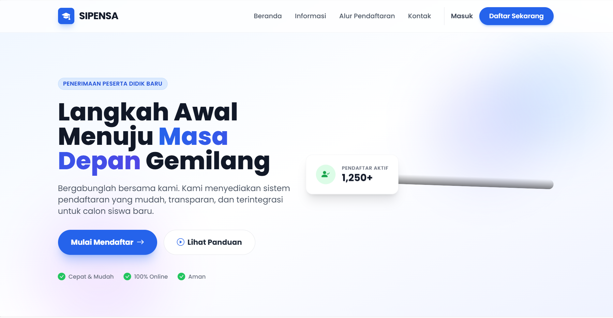

# SIPENSA - Sistem Penerimaan Siswa Baru



Aplikasi Manajemen Sekolah khusus untuk sistem PPDB (Penerimaan Peserta Didik Baru), dibangun dengan teknologi web modern untuk menjamin kemudahan pendaftaran dan seleksi calon siswa secara efisien.

## Fitur Utama

### 🧑‍🎓 Portal Calon Siswa
- **Registrasi Akun:** Pendaftaran online mandiri dengan email aktif.
- **Kelengkapan Data:** Formulir dinamis untuk Biodata, Data Orang Tua, dan Asal Sekolah.
- **Upload Berkas:** Mengunggah dokumen persyaratan (format PDF/JPG) yang diverifikasi panitia.
- **Informasi Status:** Melacak progres kelengkapan data & status kelulusan *real-time*.
- **Unduh Bukti:** Mencetak (PDF) Bukti Pendaftaran ketika berkas dinyatakan valid & lengkap.

### 💼 Portal Admin (Panitia)
- **Dashboard Analitik:** Menyajikan statistik cepat pendaftar dan gelombang aktif.
- **Manajemen Pendaftar:** Memantau dan melakukan pencarian data pendaftar.
- **Verifikasi Berkas:** Menyetujui atau menolak dokumen persyaratan secara individual.
- **Hasil Seleksi:** Menentukan kelulusan pendaftar dengan melampirkan nilai dan catatan akhir.
- **Master Data:** Konfigurasi Tahun Ajaran & Manajemen Gelombang Pendaftaran.
- **Cetak Laporan:** Laporan hasil kelulusan peserta yang dapat langsung dicetak.

## Tech Stack
- **Framework Utama:** Laravel 13
- **Database:** MySQL
- **Frontend & Styling:** Tailwind CSS, Alpine.js, Blade Templates (dukungan integrasi komponen React.js)
- **Build Tools:** Vite
- **Modul Tambahan:** barryvdh/laravel-dompdf (untuk eksportir PDF)

## Akses Pengujian / Demo

Aplikasi ini sudah dipasang dan memiliki default pengguna untuk memudahkan pengujian.

**Akun Administrator:**
- **Email:** `admin@sipensa.com`
- **Password:** `password`

*Silakan masuk melalui `/login` dan uji coba alur secara keseluruhan.*

## Instalasi (Manual)

Untuk menjalankan proyek ini pada server lokal (seperti XAMPP/Laragon):

1. **Klon / Unduh** repositori ke direktori root Anda.
2. Lakukan instalasi dependensi Composer:
   ```bash
   composer install
   ```
3. Lakukan instalasi dependensi NPM:
   ```bash
   npm install
   ```
4. Copy file `.env.example` menjadi `.env` lalu sesuaikan konfigurasi database Anda.
5. Bangkitkan App Key:
   ```bash
   php artisan key:generate
   ```
6. Jalankan Migrasi dan Seeder (Untuk setup akun default & data awal):
   ```bash
   php artisan migrate:fresh --seed
   ```
7. Kompilasi Aset Frontend:
   ```bash
   npm run build
   ```
8. Buka di browser lokal Anda.

---
*Dibuat untuk kelancaran penyelenggaraan Manajemen Sekolah PPDB.*